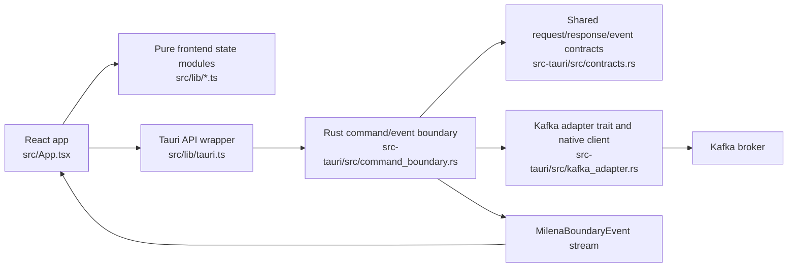

# AGENTS.md

## Documentation Lookup

Use the `ctx7` CLI to fetch current documentation whenever the user asks about a
library, framework, SDK, API, CLI tool, or cloud service. This includes API
syntax, configuration, version migration, library-specific debugging, setup
instructions, and CLI tool usage.

Do not use `ctx7` for refactoring, writing scripts from scratch, debugging
business logic, code review, or general programming concepts.

Steps:

1. Resolve the library:

   ```sh
   npx ctx7@latest library <name> "<user's full question>"
   ```

2. Pick the best match by exact name, description relevance, snippet count,
   source reputation, and benchmark score. Try alternate names or a clearer
   query if the results do not fit.
3. Fetch documentation:

   ```sh
   npx ctx7@latest docs <libraryId> "<user's full question>"
   ```

4. Answer using the fetched documentation.

Call `library` first unless the user provides a valid `/org/project` or
`/org/project/version` ID directly. Do not run more than three `ctx7` commands
per question. Do not include secrets in documentation queries. If `ctx7` fails
with a quota error, tell the user and suggest `npx ctx7@latest login` or setting
`CONTEXT7_API_KEY`.

## Product Context

Milena is a macOS-only local developer desktop app for tactical Kafka work. The
MVP is intentionally narrow: load one environment, list/search/pin topics, poll
records produced after a session starts, publish validated JSON, and keep
feedback visible in pane-level and global activity surfaces.

Primary references:

- `docs/milena-mvp-goals.md` is the product contract.
- `DESIGN.md` is the UI direction and density guide.
- `docs/kafka-integration.md` is the local Kafka broker and manual verification
  runbook.
- `README.md` has the normal local development commands.

Stay inside the MVP unless the user explicitly expands scope. Avoid automatic
Kafka activity: split panes start empty, sessions reset after restart, topic
refresh is manual after initial environment load, and consumers start only after
explicit user action.

## Architecture Map



Use the command/event boundary as the highest-value product seam. Keep frontend
state transitions testable through pure modules under `src/lib`, and keep Kafka
client complexity behind the adapter and contract types in `src-tauri/src`.

## Before Coding

Try to understand the problem before writing code.

- Interview the user when the requested behavior, scope, or acceptance criteria
  are unclear.
- Explore the existing code patterns before choosing an implementation shape.
- Ask questions instead of jumping into assumptions when a reasonable assumption
  could change user-visible behavior or architecture.
- When unsure about user-agent alignment, tell the user what you are doing,
  explain the plan, and include an architecture diagram for the relevant area.
- Keep implementation steps short and tied to the original requirement. Do not
  add adjacent features, speculative abstractions, or polish that was not asked
  for.

## Implementation Style

- Prefer clear, boring code over clever code.
- Use deep modules: keep interfaces simple and let implementation details live
  behind those interfaces.
- Avoid unnecessary small-function factoring. Extract helpers when they reduce
  real complexity or make a public seam clearer.
- Preserve original explanatory comments and extend them when the surrounding
  behavior changes.
- Do not add comments that reference issue numbers, chats, review threads, or
  temporary conversation context. Comments should explain durable code behavior.
- Keep comments general and useful after the current task is forgotten.
- Match existing TypeScript and Rust naming, file organization, and test style.
- Do not introduce broad refactors while implementing a narrow product change.

## Predictive TDD

When implementing new features or updating existing behavior, use a predictive
TDD strategy. Consult the available TDD skill when the task involves feature
work, bug fixes, integration tests, or behavior changes.

Before writing test code, define the behavior scenarios in this structure:

```md
Input data (context, parameters, state)
- ...

Expected outcomes (results, side effects, API calls)
- ...

Validation rules
- ...
```

Then write the actual test and implementation in small vertical slices:

1. Pick one behavior scenario.
2. Write one failing test through a public interface or product seam.
3. Implement only enough code to satisfy that behavior.
4. Run the focused test.
5. Repeat for the next behavior.
6. Refactor only after the relevant tests are green.

Do not write a large batch of tests before implementation. Do not test private
implementation details when a public module, Tauri command/event boundary, or
Kafka adapter contract can express the behavior.

## Testing Guidance

Frontend:

- Use Vitest tests in `src/lib/*.test.ts` for pure workspace, topic, message,
  publisher, polling, and activity behavior.
- Prefer observable state transitions and API-call effects over component
  internals.
- Keep pane behavior explicit: empty split panes, selected pane, local errors,
  bounded activity, producer ack state, and render preferences.

Rust:

- Use `src-tauri/tests/command_event_harness.rs` for public command, response,
  error, and event serialization contracts.
- Use `src-tauri/tests/kafka_adapter.rs` for Kafka adapter configuration and
  command routing behavior without requiring a broker.
- Keep real broker tests opt-in under `src-tauri/tests/` and gated by
  `MILENA_KAFKA_INTEGRATION=1`.
- Verify native Kafka behavior through the command/event boundary whenever
  possible.

Run focused tests first, then broaden as risk increases.

Common commands:

```sh
npm run test
npm run build
cd src-tauri && cargo test
npm run kafka:check
```

`npm run kafka:check` uses the local Kafka compose broker and is for manual
integration verification, not a default quick check.

## UI Guidance

Follow `DESIGN.md`.

- Build a dense, work-focused desktop tool, not a marketing dashboard.
- Prefer compact rails, panes, stream rows, separators, and subtle status
  surfaces over nested cards.
- Keep Kafka activity explicit: empty panes must not look active.
- Keep producer ack/status visually separate from consumer feedback.
- Keep pane-level errors local and global activity clearable.
- Preserve responsive behavior without horizontal scrolling.

## Scope Boundaries

In scope for MVP work:

- macOS local developer build.
- Tauri v2, React, TypeScript, and Rust.
- Native Rust Kafka client path.
- Environment metadata and auth template behavior.
- SASL_SSL with PLAIN and SCRAM.
- Topic list/search/pin, pane layout, latest-only polling, validated JSON
  publishing, optional keys, pane errors, and global activity.

Out of scope unless the user explicitly asks:

- Windows or Linux builds.
- Signing and notarization.
- Kafka CLI as the primary implementation path.
- Schema registry, Avro, Protobuf, raw publishing mode, publish headers, lag
  views, partition explorers, topic config inspection, auto-refreshing topics,
  auto-restoring sessions, or multi-environment workspaces.
