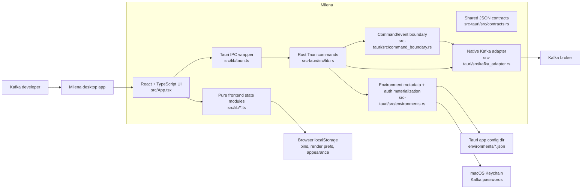
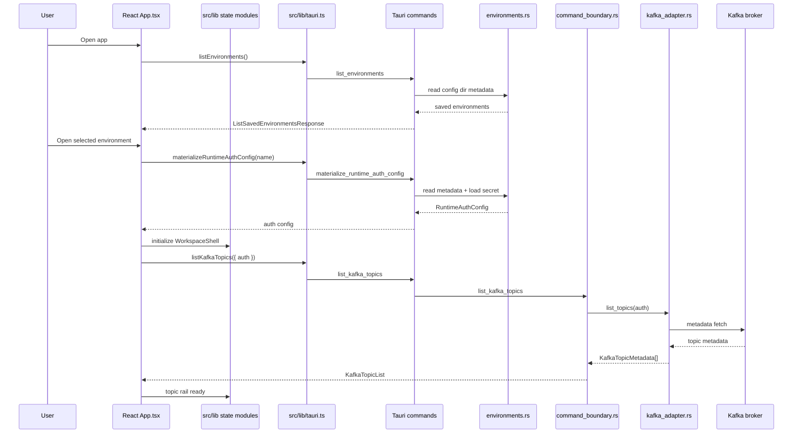
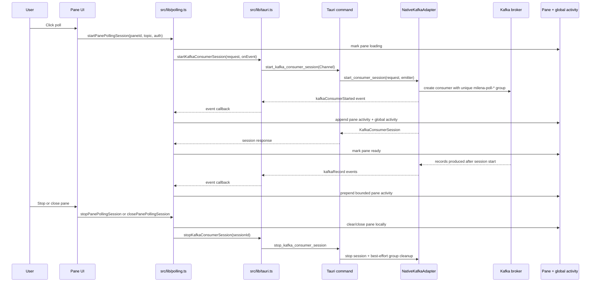
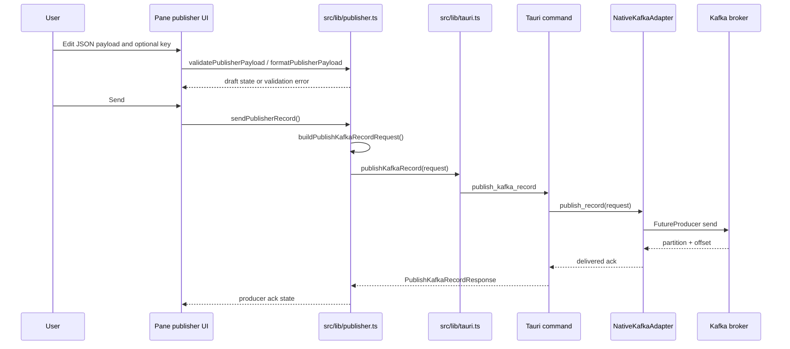
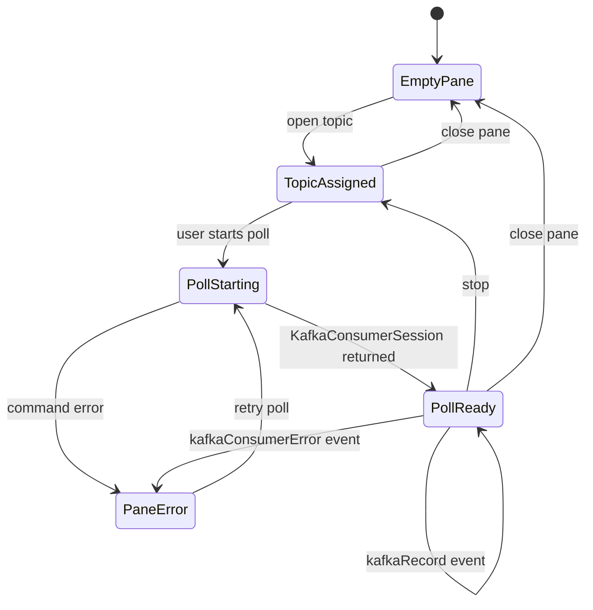

# Milena Architecture

Milena is a macOS-only Tauri desktop app for tactical Kafka work. The current
MVP is intentionally narrow: choose one saved environment, list topics on
demand, open topics into panes, start explicit latest-only polling sessions,
publish validated JSON, and keep pane-level and global feedback visible.

The highest-value architecture boundary is the Tauri command and event
boundary. The React frontend owns workspace state and rendering. The Rust
backend owns environment materialization, secret access, Kafka client setup, and
Kafka commands/events.

## System Context



## Source Map

```mermaid
flowchart TB
  Root["Repository root"]

  Root --> Frontend["src/"]
  Frontend --> Entry["main.tsx\nboot appearance + React mount"]
  Frontend --> App["App.tsx\nonboarding, workspace shell, panes, rails"]
  Frontend --> Styles["App.css\ndesktop workbench layout"]
  Frontend --> Lib["lib/"]

  Lib --> Appearance["appearance.ts\nsystem/light/dark preference"]
  Lib --> Onboarding["onboarding.ts\nenvironment chooser form state"]
  Lib --> Topics["topics.ts\ntopic list, search, pins"]
  Lib --> Workspace["workspace.ts\npane layout and pane lifecycle state"]
  Lib --> Polling["polling.ts\nconsumer session orchestration"]
  Lib --> Publisher["publisher.ts\nJSON draft, send request, ack state"]
  Lib --> Messages["messages.ts\nrecord rendering, filters, preferences"]
  Lib --> Activity["activity.ts\nglobal activity log"]
  Lib --> Tauri["tauri.ts\nfrontend command/event types and invoke calls"]

  Root --> Backend["src-tauri/src/"]
  Backend --> Main["main.rs\nstarts milena_lib"]
  Backend --> LibRs["lib.rs\nTauri builder and command registration"]
  Backend --> Contracts["contracts.rs\nserialized request, response, event, error types"]
  Backend --> Boundary["command_boundary.rs\napp-level command functions"]
  Backend --> Env["environments.rs\nmetadata files, Keychain, runtime auth"]
  Backend --> Kafka["kafka_adapter.rs\nlibrdkafka topic, publish, consumer sessions"]

  Root --> Tests["Tests"]
  Tests --> FrontTests["src/lib/*.test.ts\npure state and request behavior"]
  Tests --> AppTests["src/App*.renderer.test.tsx\nrenderer flows"]
  Tests --> RustTests["src-tauri/tests/*.rs\ncontracts, env storage, adapter, broker integration"]
  Tests --> Scenarios["scenarios/e2e/*.approved.md\napproved manual/e2e scenarios"]
```



## Runtime Flow







## Frontend Ownership

`src/App.tsx` is the composition layer. It wires React state to UI regions,
calls the Tauri wrapper, and translates side effects into pure state updates.
The major UI regions are:

| Region | Responsibility |
| --- | --- |
| `EnvironmentChooser` | First-run, saved environment list, create/edit/delete, connection testing. |
| `WorkspaceShell` | Active environment workspace, topic rail, pane grid, right rail, Tauri calls. |
| `Pane` | Pane-scoped consumer stream, publisher draft editor, render mode, split/stop/close actions. |
| `RightRail` | Selected pane/topic preview, layout status, global activity and errors. |
| `TopicContextMenu` | Open topic into selected pane or a split pane. |

The pure modules under `src/lib` keep behavior testable without rendering:

| Module | Owns |
| --- | --- |
| `appearance.ts` | Appearance preference persistence and DOM theme resolution. |
| `onboarding.ts` | Saved environment chooser state, form validation, delete confirmation. |
| `topics.ts` | Topic rail state, manual load status, search, ordering, per-environment pins. |
| `workspace.ts` | Pane IDs, selected pane/topic, split layouts, empty pane semantics, pane activity. |
| `polling.ts` | Latest-only consumer requests, start/stop orchestration, stale-run protection. |
| `publisher.ts` | JSON validation/formatting, publisher draft state, send request building, ack/error state. |
| `messages.ts` | Kafka record identity, JSON/raw rendering, truncation, filtering, render preferences. |
| `activity.ts` | Clearable global activity/error entries and boundary event summaries. |
| `tauri.ts` | TypeScript mirrors of Rust contracts plus `invoke` and `Channel` wiring. |

Frontend persistence uses browser localStorage for UI-only preferences:

| Key | Purpose |
| --- | --- |
| `milena.lastSelectedEnvironment.v1` | Last selected environment in the chooser. |
| `milena.topicPins.v1` | Pinned topics by environment. |
| `milena.messageRenderPreferences.v1` | JSON/raw render preference by environment and topic. |
| `milena.appearance.v1` | System/light/dark appearance preference. |

Active Kafka sessions, pane activity, publisher drafts, and workspace layout are
in-memory only. They reset when the app restarts or when the user changes the
active environment.

## Backend Ownership

`src-tauri/src/lib.rs` registers the Tauri commands and owns app startup. Kafka
commands run through `tauri::async_runtime::spawn_blocking` so the UI-facing
Tauri command path does not block on librdkafka setup, metadata fetches,
producer sends, or stop cleanup.

| Module | Owns |
| --- | --- |
| `contracts.rs` | Serde request, response, event, capability, and error contracts shared with the frontend. |
| `command_boundary.rs` | App-level command functions over traits. This is the main test seam for command responses and ordered events. |
| `environments.rs` | Environment metadata files, validation, advanced property parsing, auth materialization, macOS Keychain access. |
| `kafka_adapter.rs` | `KafkaAdapter` trait and native librdkafka implementation for topic listing, publishing, consumers, and cleanup. |

Environment persistence is split by sensitivity:

| Data | Location |
| --- | --- |
| Environment name, brokers, auth mode, username, advanced properties | Tauri app config dir under `environments/<hex-name>.json`. |
| Kafka password | macOS Keychain service `milena.kafka.environment`, account `environment:<hex-name>:password`. |
| Runtime auth config | Materialized on demand from metadata + Keychain secret and returned to the frontend for command calls. |

The backend supports `PLAINTEXT` and `SASL_SSL` with `PLAIN` or
`SCRAM-SHA-512` through the environment model. The native adapter also accepts
`SCRAM-SHA-256` when a runtime config supplies it directly.

## Command And Event Boundary

The frontend calls these Tauri commands through `src/lib/tauri.ts`:

| Command | Rust entry point | Purpose |
| --- | --- | --- |
| `get_app_state` | `get_app_state` | Runtime capabilities and app metadata. |
| `list_environments` | `list_environments` | Read saved environment metadata. |
| `save_environment` | `save_environment` | Validate and persist metadata; save password to Keychain when needed. |
| `load_environment` | `load_environment` | Load one saved metadata record. |
| `delete_environment` | `delete_environment` | Delete metadata and best-effort Keychain secret. |
| `materialize_runtime_auth_config` | `materialize_runtime_auth_config` | Build a runtime Kafka auth config from saved metadata and secret. |
| `materialize_temporary_runtime_auth_config` | `materialize_temporary_runtime_auth_config` | Build runtime auth for connection testing without saving metadata. |
| `list_kafka_topics` | `list_kafka_topics` | Fetch non-internal topic metadata from Kafka. |
| `publish_kafka_record` | `publish_kafka_record` | Send one payload and return producer ack details. |
| `start_kafka_consumer_session` | `start_kafka_consumer_session` | Start a latest-only pane consumer and stream events over a Tauri `Channel`. |
| `stop_kafka_consumer_session` | `stop_kafka_consumer_session` | Stop a consumer session and attempt temporary group cleanup. |
| `preview_topic_session` | `preview_topic_session` | Lightweight preview/boundary harness command retained in the contract tests. |

Boundary events are discriminated JSON payloads:

| Event | Emitted by | Meaning |
| --- | --- | --- |
| `boundaryOpened` | `preview_topic_session` | Preview command accepted a topic and mode. |
| `boundaryReady` | `preview_topic_session` | Preview command capabilities are ready. |
| `kafkaConsumerStarted` | `NativeKafkaAdapter::start_consumer_session` | Kafka consumer subscribed and session metadata is available. |
| `kafkaRecord` | `run_consumer_loop` | A record arrived for a session. |
| `kafkaConsumerError` | `run_consumer_loop` | Consumer receive failed but the pane can surface the error locally. |
| `kafkaConsumerStopped` | `run_consumer_loop` | Stop signal was received by the consumer task. |

## Kafka Session Model



Consumer details:

- Each session uses a unique `milena-poll-*` consumer group.
- `fromBeginning` defaults to `false`; pane polling builds latest-only requests.
- The native adapter sets `enable.auto.commit=false`, `enable.partition.eof=false`,
  and `auto.offset.reset=latest` for normal pane sessions.
- The adapter stores active sessions in a mutex-protected map keyed by session
  ID. Each entry has the runtime auth, group ID, and a stop channel.
- Stop is explicit and cleanup is best effort. Cleanup success or failure is
  reported in `StopKafkaConsumerSessionResponse`.
- Pane activity is bounded at 1,000 entries; global activity is bounded at 50.

## Build And Runtime Configuration

| Area | Current setup |
| --- | --- |
| Frontend | Vite + React 19 + TypeScript. Dev server binds `127.0.0.1:5173`. |
| Desktop shell | Tauri v2, product name `Milena - Kafka Reader`, minimum window `960 x 640`. |
| Rust backend | Rust 2021, minimum Rust `1.77`, `rdkafka` with vendored SSL and CMake build. |
| Icons and bundle | App bundle target only; signing and notarization are outside MVP scope. |
| Tauri permissions | `core:default` for the local developer app. |

Common commands:

```sh
npm run dev
npm run test
npm run build
npm run tauri:dev
npm run tauri:build
cd src-tauri && cargo test
npm run kafka:check
```

`npm run kafka:check` starts from the local compose broker runbook and is for
manual integration verification, not the default quick check.

## Verification Map

| Layer | Tests and checks |
| --- | --- |
| Pure frontend state | `src/lib/*.test.ts` with Vitest. |
| Renderer flows | `src/App.renderer.test.tsx` and `src/App.onboarding.renderer.test.tsx`. |
| Command/event contracts | `src-tauri/tests/command_event_harness.rs`. |
| Environment persistence and Keychain abstraction | `src-tauri/tests/environment_storage.rs`. |
| Kafka adapter config and command routing | `src-tauri/tests/kafka_adapter.rs`. |
| Real broker behavior | `src-tauri/tests/kafka_integration.rs`, gated by `MILENA_KAFKA_INTEGRATION=1`. |
| Approved scenario checks | `scenarios/e2e/*.approved.md` through `npm run e2e:scenarios`. |

## Boundaries To Preserve

- Do not auto-start consumers. Polling is explicit and pane-scoped.
- Do not auto-refresh topics after the initial environment load unless the user
  requests refresh.
- Newly split panes start empty and must not inherit topic activity or consumer
  sessions from the source pane.
- Keep producer ack/status visually and structurally separate from consumer
  feedback.
- Keep environment metadata separate from secrets. Passwords should not be
  written into app config files.
- Prefer testing through public seams: frontend pure modules, Tauri command
  contracts, and the `KafkaAdapter` trait.
- Keep Kafka implementation details behind `src-tauri/src/kafka_adapter.rs`;
  frontend modules should only see command contracts and boundary events.
